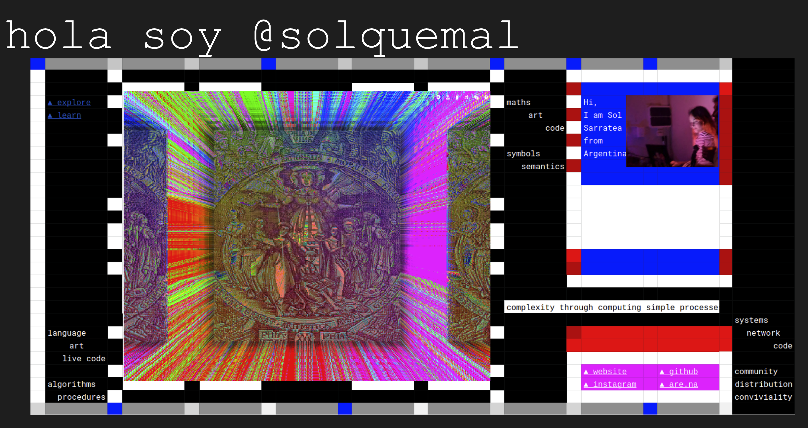
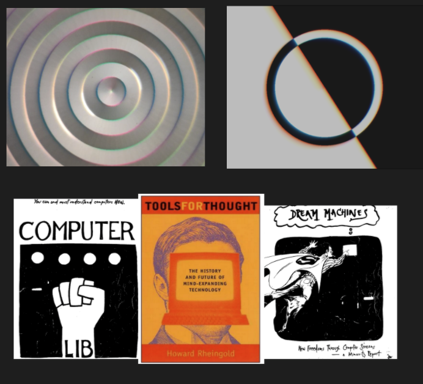

# Quienes somos

## Facilitado por CCEBA Media Lab

El **CCEBA Centro Cultural de España en Buenos Aires** forma parte de la Red de Centros de Cooperación Cultural de la Agencia Española de Cooperación Internacional para el Desarrollo (AECID).

[Más info](http://www.cceba.org.ar/quienes-somos-2)

## Sol Sarratea

Es de Buenos Aires Argentina, estudiante de la facultad de Ciencias Exactas-UBA; desarrolladora en computación gráfica y artista computacional. Le apasiona construir sistemas complejos a partir de componer procesos simples, usando tecnologías de bajo nivel.

Es miembro de CliC; Colectivo de Live Coders. Sus proyectos son alentados por comunidades de código abierto; aprendizaje alternativo; y por la necesidad de construir una identidad propia.\
Participó en el Recurse Center - Nueva York; y en la academia de verano de Hackers\&Designers - Holanda. Lideró el curso sobre `Alquimia Digital` en Hyperlink Academy. Asistió y dictó workshops introductorios a GLSL en inglés y en español: en CODAME; WIP:Arte Digital; y NODO: Centro Cultural Digital.&#x20;

Recientemente:

.jpeg>)

A continuación mis cartas de presentación:

 
